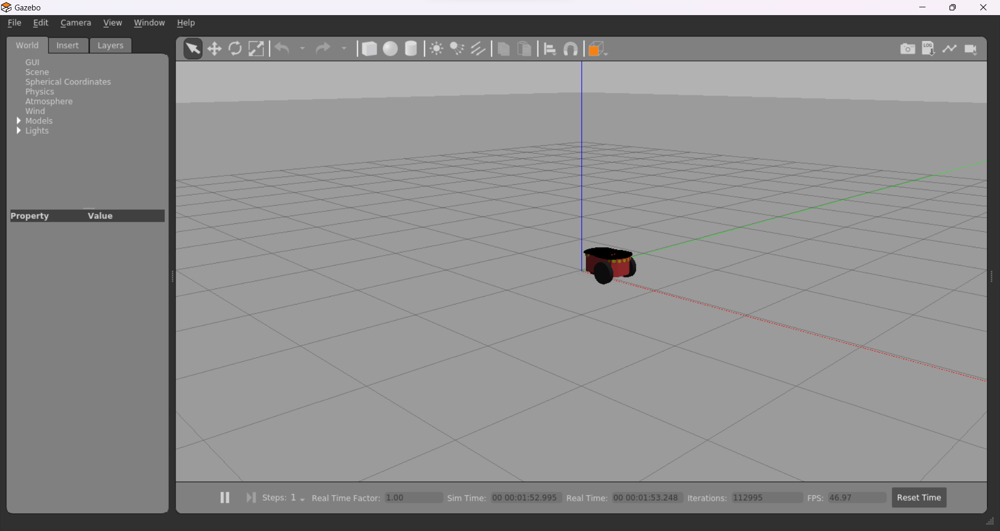
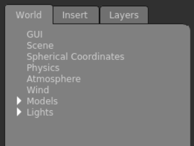

# Gazebo Simulator

O simulador Gazebo permite que você teste algoritmos rapidamente, edite robôs, treine sistemas de IA e muito mais. Ele é mantido pela **Open Source Robotics Foundation (OSRF)**.

## Por quê trabalhar com o Gazebo?

O Gazebo é o simulador padrão de ROS. Ele provê todas as informações que você precisa sobre o ambiente e o robô. Você pode até mesmo debuggar seu software e a simulação juntos para ver qual deles está falhando. Se você quiser testar um caso específico, você pode forçar a situação e observar o seu software exectuar repetidamente até que você consiga informações suficientes.

## Construir um robô é caro

Você não precisa testar seu software em um robô real para encontrar erros e ajustar parâmetros. Falhar em um robô simulado é mais rápido e mais barato.

# Preparando a simulação

Para que comecemos nosso tutorial de Gazebo, é necesário baixar alguns pacotes antes de rodar o código:

```bash
sudo apt-get update &&
sudo apt install ros-noetic-dynamixel-sdk &&
sudo apt install ros-noetic-turtlebot3-msgs &&
sudo apt install ros-noetic-turtlebot3

```

## Simulando pela primeira vez

Abra um terminal e insira o seguinte comando:

```bash
gazebo worlds/pioneer2dx.world
```

Essa nova janela deve aparecer:



Parabéns! Você fez o seu primeiro launch de gazebo.

## World

O **world** (mundo) é o ambiente completo da simulação. Ele contém tudo e está descrito em um arquivo **.world**. Esse arquivo é formatado usando *SDF (Simulation Description Format)*. Você pode observar todos os componentes do mundo através do menu à esquerda, na aba "World":


