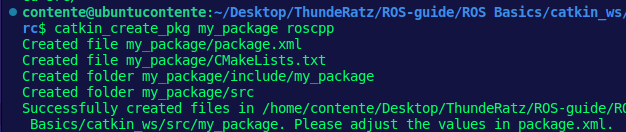

README
================
Sergio Contente
2023-05-11

# :seedling: ROS Basics - Conceitos Fundamentais

Antes de comerçar a aprender qualquer coisa, é preciso definir alguns
fundamentos essenciais para entrar no mundo ROS sem ter grandes
complicações futuras por falta de embasamento. Com isso, a ideia deste
módulo é nivelar todos que já tiveram algum tipo de contato com a
tencologia ou nunca nem mexeram na mesma.

## O que é ROS?

Do próprio site oficial temos uma definição: “The Robot Operating System
(ROS) is a set of software libraries and tools that help you build robot
applications. From drivers to state-of-the-art algorithms, and with
powerful developer tools, ROS has what you need for your next robotics
project. And it’s all open source”. Mas isso não ajuda muito a entender,
certo? Para isso vamos investigar alguns conceitos para entender o que
essa frase quer dizer.

# Pacotes/Packages

ROS usa pacotes para organizar seus programas. Você pode pensar sobre um
pacote como sendo todos os arquivos que aquele programa ROS específico
contém. Esses arquivos são organizados na seguinte estrutura:

- /launch : Pasta que contém as “launch files”;
- /src: Pasta que contém os arquivos fontes (cpp, python);
- CMakeLists.txt: Arquivo CMake que contém regras de compilação do
  projeto;
- package.xml: Arquivo que contém informações a respeito do package e
  suas dependências.

Para ir a qualquer ROS package, você pode utilizar o comando ROS da
seguinte maneira:

``` bash
  roscd <package_name>
```

Este comando irá te levar ao caminho onde o pacote chamado
*package_name* está localizado.

# Launch files

Para exectuar programas, ROS utiliza determinados tipos de arquivos
específicos chamados de “launch files”.

Usando a launchfile file da odometria do Perse como exemplo, vamos ver
como o arquivo está estruturado:

``` xml
  <launch>
    <rosparam command="load" file="$(find perse)/config/odometry_variables.yaml"/>
  
    <node pkg="perse" type="perse" name="perse_node" output="screen"/>
  
    <!-- Dynamic update of some parameters -->
    <node pkg="rqt_reconfigure" type ="rqt_reconfigure" name="dynamic_reconfigure"    output="screen"/>
  </launch>
```

Launch files são contidas dentro de uma tag <launch>. Nessa tag, você
pode ver uma tag <node>, onde especifica alguns parâmetros:

- pkg=“perse”: Refere-se ao nome do pacote que contem o código ROS a ser
  executado.
- type=“perse”: Nome do arquivo (podendo ser tanto Python ou C++) que
  queremos executar. Deve-se ter um executável com o mesmo nome -
  veremos melhor na parte de CMakeLists.
- name=“perse_node”: Nome do ROS node (em breve, você entenderá o que é
  isso) que queremos dar launch.
- output=“screen”: Através de qual canal de saída você quer printar o
  output do seu programa.

Algumas outras tags são referentes a parâmetros de configuração. Por
hora, não se preocupe com essas tags extras e procure entender as que
foram mencionadas agora.

## Criando um package

Até agora, checamos a estrutura de um pacote ROS já feito. Mas vamos
criar um novo.

Quando queremos criar pacotes, temos que trabalhar em um workspace/área
de trabalho ROS específico/a. Esse workspace é chamado de **catkin
workspace**, que é um diretório no seu disco rígio onde os pacotes ROS
devem residir para que sejam usados. Usualmente, um diretório catkin
workspace é chamado de *catkin_ws*.

Usando o terminal do seu computador, entre no workspace deste módulo.
ele deve estar localizado em algo como:

> ../ROS-guide/ROS Basics/catkin_ws

Dentro do workspace, existe um diretório chamado de **src**. Essa pasta
*deve* conter todos os packages ROS criados. Então, entre nela usando o
comando:

``` bash
  $ cd src/
```

Para que seja possível criar nosso primeiro package, deve-se dar o
seguinte comando no terminal:

``` bash
  $ catkin_create_pkg my_package roscpp
```

Isso vai criar dentro do nosso diretório “src” um novo pacote com alguns
arquivos nele. Vamos investigar este comando:

``` bash
  catkin_create_pkg <package_name> <package_dependecies>
```

O argumento *<package_name>* é o nome do pacote que queremos criar e o
outro argumento *<package_dependencies>* são os nomes dos outros ROS
packages que queremos que este dependa (no nosso exemplo, queremos que
nosso pacote “my_package” seja criado e dependa do pacote “roscpp”).
Algo como a seguinte imagem deve aparecer no seu terminal:



Para que possamos checar se nosso pacote foi criado com sucessso,
podemos usar comandos ROS relacionados a pacotes. Por exemplo, digite no
terminal:

## Tópicos

A primeira coisa que se é necessária para aprender a trabalhar com ROS
consiste em entender como funcionam os **tópicos**. ROS lida com todos
os seus sistemas de comunicação através de tópicos, desde os mais
simples até os mais complexos, como Actions e Services por exemplo.
