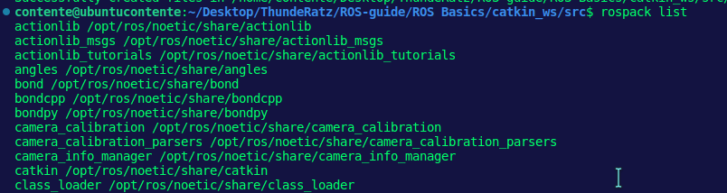
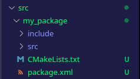
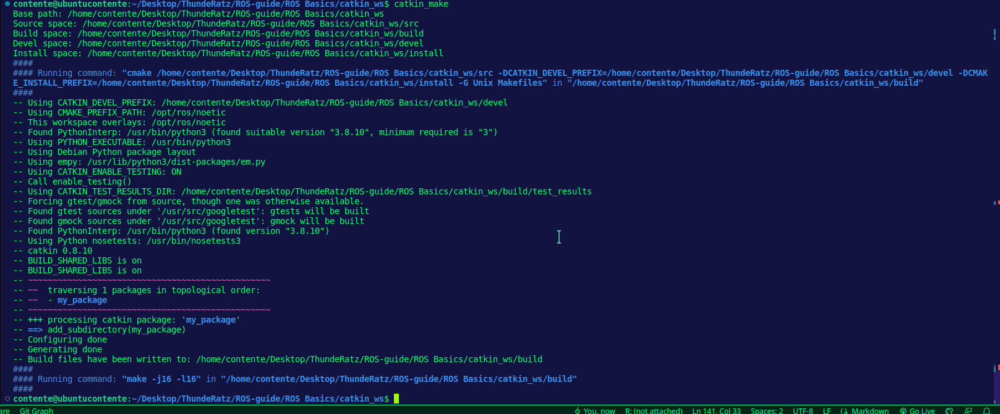
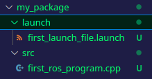
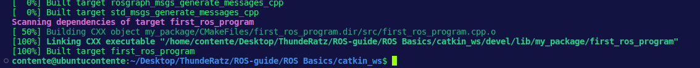
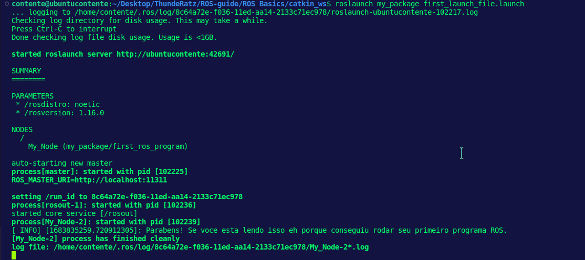
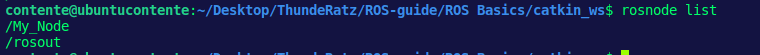
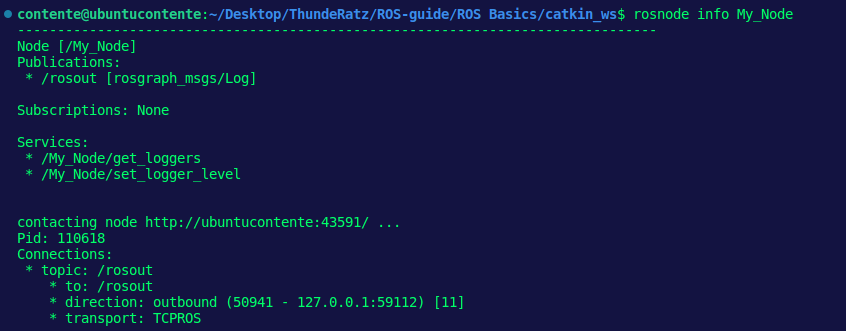
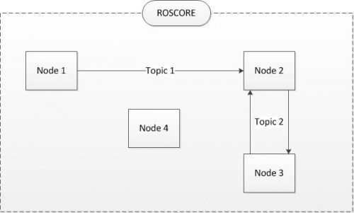
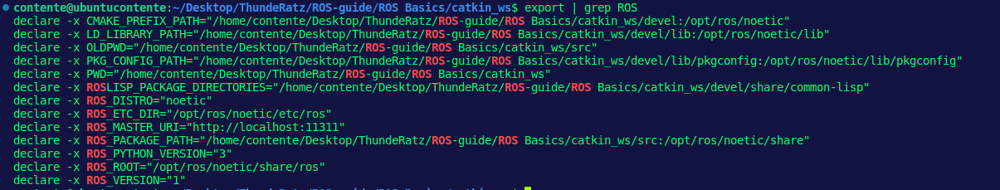

README
================
Sergio Contente
2023-05-11

# :seedling: ROS Basics - Conceitos Fundamentais

Antes de comerçar a aprender qualquer coisa, é preciso definir alguns
fundamentos essenciais para entrar no mundo ROS sem ter grandes
complicações futuras por falta de embasamento. Com isso, a ideia deste
módulo é nivelar todos que já tiveram algum tipo de contato com a
tencologia ou nunca nem mexeram na mesma.

# :robot: O que é ROS?

Do próprio site oficial temos uma definição: “The Robot Operating System
(ROS) is a set of software libraries and tools that help you build robot
applications. From drivers to state-of-the-art algorithms, and with
powerful developer tools, ROS has what you need for your next robotics
project. And it’s all open source”. Mas isso não ajuda muito a entender,
certo? Para isso vamos investigar alguns conceitos para entender o que
essa frase quer dizer.

## :package: Pacotes/Packages

ROS usa pacotes para organizar seus programas. Você pode pensar sobre um
pacote como sendo todos os arquivos que aquele programa ROS específico
contém. Esses arquivos são organizados na seguinte estrutura:

- /launch : Pasta que contém as “launch files”;
- /src: Pasta que contém os arquivos fontes (cpp, python);
- CMakeLists.txt: Arquivo CMake que contém regras de compilação do
  projeto;
- package.xml: Arquivo que contém informações a respeito do package e
  suas dependências.

Para ir a qualquer ROS package, você pode utilizar o comando ROS da
seguinte maneira:

``` bash
  roscd <package_name>
```

Este comando irá te levar ao caminho onde o pacote chamado
*package_name* está localizado.

## :rocket: Launch files

Para exectuar programas, ROS utiliza determinados tipos de arquivos
específicos chamados de “launch files”.

Usando a launchfile file da odometria do Perse como exemplo, vamos ver
como o arquivo está estruturado:

``` xml
  <launch>
    <rosparam command="load" file="$(find perse)/config/odometry_variables.yaml"/>
  
    <node pkg="perse" type="perse" name="perse_node" output="screen"/>
  
    <!-- Dynamic update of some parameters -->
    <node pkg="rqt_reconfigure" type ="rqt_reconfigure" name="dynamic_reconfigure"    output="screen"/>
  </launch>
```

Launch files são contidas dentro de uma tag <launch>. Nessa tag, você
pode ver uma tag <node>, onde especifica alguns parâmetros:

- pkg=“perse”: Refere-se ao nome do pacote que contem o código ROS a ser
  executado.
- type=“perse”: Nome do arquivo (podendo ser tanto Python ou C++) que
  queremos executar. Deve-se ter um executável com o mesmo nome -
  veremos melhor na parte de CMakeLists.
- name=“perse_node”: Nome do ROS node (em breve, você entenderá o que é
  isso) que queremos dar launch.
- output=“screen”: Através de qual canal de saída você quer printar o
  output do seu programa.

Algumas outras tags são referentes a parâmetros de configuração. Por
hora, não se preocupe com essas tags extras e procure entender as que
foram mencionadas agora.

# :inbox_tray: Criando um package

Até agora, checamos a estrutura de um pacote ROS já feito. Mas vamos
criar um novo.

Quando queremos criar pacotes, temos que trabalhar em um workspace/área
de trabalho ROS específico/a. Esse workspace é chamado de **catkin
workspace**, que é um diretório no seu disco rígio onde os pacotes ROS
devem residir para que sejam usados. Usualmente, um diretório catkin
workspace é chamado de *catkin_ws*.

Usando o terminal do seu computador, entre no workspace deste módulo.
ele deve estar localizado em algo como:

> ../ROS-guide/ROS Basics/catkin_ws

Dentro do workspace, existe um diretório chamado de **src**. Essa pasta
*deve* conter todos os packages ROS criados. Então, entre nela usando o
comando:

``` bash
  $ cd src/
```

Para que seja possível criar nosso primeiro package, deve-se dar o
seguinte comando no terminal:

``` bash
  $ catkin_create_pkg my_package roscpp
```

Isso vai criar dentro do nosso diretório “src” um novo pacote com alguns
arquivos nele. Vamos investigar este comando:

``` bash
  catkin_create_pkg <package_name> <package_dependecies>
```

O argumento *<package_name>* é o nome do pacote que queremos criar e o
outro argumento *<package_dependencies>* são os nomes dos outros ROS
packages que queremos que este dependa (no nosso exemplo, queremos que
nosso pacote “my_package” seja criado e dependa do pacote “roscpp”).
Algo como a seguinte imagem deve aparecer no seu terminal:


Para que possamos checar se nosso pacote foi criado com sucessso,
podemos usar comandos ROS relacionados a pacotes. Por exemplo, digite no
terminal:

``` bash
  $ rospack list
```

Então, ele deverá responder algo como:


Isso significa que todos esses pactores nativos do ROS (vem com ele ao
instalar o desktop-full) foram criados junstamente com o nosso pacote
*my_package*. O jeto mais fácil de se conferir que ele foi criado
corretamente é vendo se os arquivos padrões dele estão no nosso
diretório principal:



## :outbox_tray: Compilando um package

Após criarmos nosso pacote, naturalmente será necessário compilá-lo.
Existem diferentes métodos para fazer isso mas os que mais são comuns
são esses:

- catkin_make
- catkin build

Neste tutorial usarei o “catkin_make”, por ser uma das opções mais
populares e portanto encaixa-se no propósito de um guia básico. Mas é
bom saber que o “catkin build” é bem mais eficiente por usar
paralelismo.

**ATENÇÃO! AGORA É UM MOMENTO DE EXTREMO CUIDADO**

> Para que o comando compile o seu diretório *src*, ele precisa ser
> executado no seu workspace catkin - ou seja, no *catkin_ws* no nosso
> exemplo - para funcionar.

Isso é obrigatório, tente compilar em outro diretório e não vai
funcionar. Então dentro da sua “catkin_ws”, execute:

``` bash
  cd ../../catkin_ws
  catkin_make
```

O terminal vai dar algumas saídas do tipo:



Após compilar, é muito importante dar um *source* no seu workspace para
que seja possível atualizar as últimas mudanças feitas pós-compilação no
ROS.

``` bash
  source devel/setup.bash
```

## :outbox_tray: Compilando packages individualmente

Às vezes em projetos grandes, você não quer compilar todos os seus
pacotes a todo momento dado que isso levaria uma grande quantidade de
tempo gasta inutilmente. Normalmente, você vai querer compilar apenas os
pacotes que sofreram algum tipo de modificação. Para isso, existe uma
variação do catkin_make:

``` bash
  catkin_make --only-pkg-with-deps <package_name>
```

Esse comando vai compilar apenas os pacotes escpeficiados nos argumentos
e suas dependências.

# :one: Meu primeiro programa ROS

Nesse ponto, você já deve ter o seu primeiro pacote criado, agora vamos
para coisas mais legais. Dentro do seu diretório *src/* no pacote
*my_package* você vai colocar os arquivos em C++/Python a serem
executados. Para esse guia, vou usar C++ deliberadamente. Então vá lá e
crie um arquivo chamado: “first_ros_program.cpp”. Edite esse arquivo e
coloque o seguinte código nele:

``` cpp
  #include <ros/ros.h>
//Aqui estamos incluindo todos os headers necessários para as funcionalidades mais comuns e essenciais de um sistema ROS
//Sempre que criamos um arquivo C++, devemos adicionar esse include.

int main(int argc, char** argv) { //Começamos nossa rotina principal de um programa em C++

    ros::init(argc, argv, "My_Node"); //Iniciamos nosso ROS node chamado "My_Node"
    ros::NodeHandle nh; //Criamos um handler para o node. Esse handler vai na verdade fazer a iniciação do node
    ROS_INFO("Parabens! Se voce esta lendo isso eh porque conseguiu rodar seu primeiro programa ROS."); //Equivale à função print em ROS.
    ros::spinOnce(); //Chamar esse método aqui não é necessário para esse exemplo básico em específico porque não estamos recebendo nenhum callback.
        //Entretanto, se você tivesse criado um subscriber nesse programa e não chamasse essa função, seus callbacks não seriam chamados nem atualizados, então é de boa prática.
    return 0; //Fim do programa
}

```

Após isso, crie seu diretório *launch/* dentro do mesmo package. Esse
diretório, como dito antes, guardará nossas launch files para executar
nossos programas. Para tal faça os seguinte comando no terminal:

``` bash
  roscd my_package
  mkdir launch
```

Você também pode fazer isso por interface gráfica da sua IDE favorita.
Aproveite e cria um arquivo chamado “first_launch_file.launch” dentro
dessa pasta. Sua árvora de arquivos deve estar parecida com o seguinte:



E então edite a launh file para que possamos executar nosso código da
seguinte maneira:

``` xml
  <launch>
    <!-- My Package launch file -->
    <node pkg="my_package" type="first_ros_program" name="My_Node"  output="screen">
    </node>
  </launch>
```

**Lembre-se, o executável (nosso arquivo cpp) deve ser referenciado em
*type*. Portanto, se você nomeou seu .cpp com outro nome, altere lá
também**.

## :zap: Gerando nosso executável

Para que possamos executar nosso programa, devemos alterar a nossa
CMakeLists.txt a partir do arquivo C++ que acabamos de criar. Para tal,
vamos editar o arquivo CmakeLists.txt dentro da pasta do nosso package
*my_package*. Procure dentro do arquivo a seção escrita como BUILD (em
comentários) e adicione no fim dela o seguinte código:

``` txt
  add_executable(first_ros_program src/first_ros_program.cpp)
  add_dependencies(first_ros_program ${first_ros_program_EXPORTED_TARGETS} ${catkin_EXPORTED_TARGETS})
  target_link_libraries(first_ros_program
    ${catkin_LIBRARIES}
  )
```

## :tornado: Compilando e dando launch

Agora que modificamos nossa Make file (CMake), temos que compilar o
nosso package novamente através do comando catkin_make. Lembre-se de
estar dentro da workspace para isso.

Dentro da catkin_ws, dê o seguinte comando:

``` bash
  $ catkin_make
```

Algo no seu terminal deve estar diferente da outra vez que você executou
o mesmo. Na verdade se você reparar, o executável CXX (C++) foi
buildado, linkado e agora podemos dar launch no nosso programa, também
chamado de ROS node.



Finalmente, vamos dar launch:

``` bash
  roslaunch my_package first_launch_file.launch
```

**Se você deu um nome alternativo para sua launch file, faça as devidas
alterações para funcionar**. E então a saída espera é a seguinte:



## :persevere: Caso não dê certo

Às vezes, ROS não detecta novos pacotes recém-criados e não será capaz
de dar roslaunch. Nesse caso, você pode forçar o ROS a atualziar sua
lista de packages com o comando:

``` bash
  rospack profile
```

# :teacher: Entendendo os códigos apresentados

## Primeiro programa ROS

Em relação ao nosso programa principal, comentei linha por linha
explicando o que significa cada coisa. Acredito que seja o jeito mais
simples de se entender de fato o que está acontecendo por baixo dos
panos.

## Alterações na CMakeLists

> add_executable(first_ros_program src/first_ros_program.cpp)

Essa linha gera um executável a partir do seu arquivo .cpp, localizado
dentro da pasta *src/* no seu package. Esse executável vai ser colocado
por padrão dentro do diretório do seu pacote do seu espaço devel (esse
último está localizado por default em catkin_ws/devel/lib/).

> add_dependencies(first_ros_program
> \${first_ros_program_EXPORTED_TARGETS} \${catkin_EXPORTED_TARGETS})

Essa linha adiciona todas as dependências do target do CMake do nosso
executável. É usado basicamente para permitir que o CMake compile
corretamente o pacote, assegurando-se de que as dependências dele
estarão sendo respeitadas.

> target_link_libraries(first_ros_program \${catkin_LIBRARIES} )

Essa linha especifica as bibliotecas a serem usadas quando linkamos um
determinado target. Neste caso, ele indica que vamos usar as bibliotecas
catkin quando formos linkar nosso executável.

# :volleyball: ROS Nodes

Vamos listar os nodes ativos após darmos launch. Para isso, abra um novo
terminal e rode o seguinte comando:

``` bash
  rosnode list
```

… UÉ?! Cadê nosso node “My_Node” na saída do terminal? Isso acontece
porque um node é encerrado assim que um programa C++ termina. Vamos
deixar nosso node rodando em um looping para consertar isso:

``` cpp
  #include <ros/ros.h>
//Aqui estamos incluindo todos os headers necessários para as funcionalidades mais comuns e essenciais de um sistema ROS
//Sempre que criamos um arquivo C++, devemos adicionar esse include.

int main(int argc, char** argv) { //Começamos nossa rotina principal de um programa em C++

    ros::init(argc, argv, "My_Node"); //Iniciamos nosso ROS node chamado "My_Node"
    ros::NodeHandle nh; //Criamos um handler para o node. Esse handler vai na verdade fazer a iniciação do node
    ros::Rate loop_rate(2); // Criamos um ojeto Rate de frequência 2 Hz
        while (ros::ok()) // Loop infinito até Ctrl+C
    {
            ROS_INFO("Parabens! Se voce esta lendo isso eh porque conseguiu rodar seu primeiro programa ROS."); //Equivale à função print em ROS.
            ros::spinOnce(); //Chamar esse método aqui não é necessário para esse exemplo básico em específico porque não estamos recebendo nenhum callback.
            //Entretanto, se você tivesse criado um subscriber nesse programa e não chamasse essa função, seus callbacks não seriam chamados nem atualizados, então é de boa prática.
            loop_rate.sleep(); // Nós paramos o tempo necessário para que a frequência fixada antes seja mantida/respeitada.
        }

        return 0; //Fim do programa
}

//Esse programa cria um loop infinito que se repete 2 vezes por segundo (2Hz) até CTRL+C
```

*Todas alterações foram comentadas linha-a-linha, para facilitar o
entendimento do que está acontecendo no código*

Compile novamente seu programa com o catkin_make e dê um launch. Após
isso execute em outro terminal:

``` bash
  $ rosnode list
```

Então, a saída esperada é a seguinte:


Podemos também extrair informações mais profundas de cada node através
do comando:

``` bash
  $ rosnode info <node_name>
```

No nosso caso, *node_name* é substituído por “My_Node”. Então temos:


# :electron: ROS Core

Para que todos os nossos nodes funcionem de maneira adequada, nós
precisamos de um ROS Core rodando primeiramente. Ele é o processo
principal que gerencia todo o nosso sistema ROS. Você vai precisar ter
um ROS Corando para trabalhar com ROS. É possível dar launch
individualmente em um ROS core com o comando:

``` bash
  $ roscore
```

Mas assim que você usa o roslaunch, ele já faz esse trabalho para você.
Abaixo está um diagrama que exemplifica um pouco esse conceit abstrato:


# :blossom: Variáveis de Ambiente

ROS usa um conjunto de variáveis de ambiente do Linux para que funcione
propriamente. Você pode checar essas variáveis através do comando:

``` bash
  $ export | grep ROS
```



Sendo as mais importantes:

- ROS_MASTER_URI -\> Contém a URL onde o ROS Core está sendo executado.
  Usualmente seu próprio computador (localhost).
- ROS_PACKAGE_PATH -\> Contém os caminhos do seu Disco Rígo onde ROS tem
  pacotes.

# :fast_forward: Conclusão

Agora você sabe o básico do funcionamento de ROS. Vá para o próximo guia
para se aprofundar cada vez mais nesse framework extremamente útil no
mundo da robótica.
