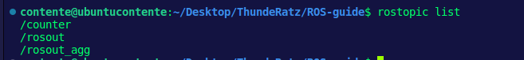
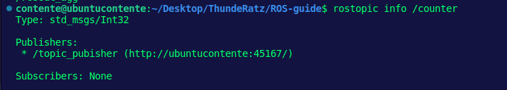
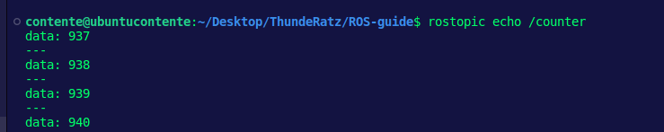
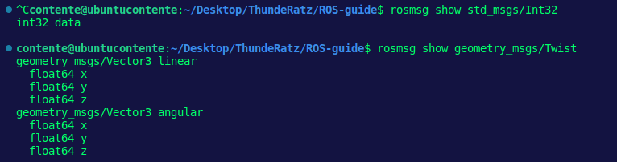

# :herb: ROS Topics - Publishers e Subscribers

Primeiramente, é essencial que você já tenha feito o primeiro módulo "ROS Basics" antes de prosseguir com esse aqui. Irei assumir que você já sabe com maestria como criar pacotes, fazer launchfiles e criar executáveis básicos no CMakeLists durante todo o processo. No repositório, você já encontra um *catkin_ws/* contendo 2 pacotes gerados por mim: *publisher_pkg* e *subscriber_pkg*.

# :memo: Tópicos

A primeira coisa que se é necessária para aprender a trabalhar com ROS
consiste em entender como funcionam os **tópicos**. ROS lida com todos
os seus sistemas de comunicação através de tópicos, desde os mais
simples até os mais complexos, como Actions e Services por exemplo. Os nodes usados em todo package vão trocar mensagens através de tópicos, sendo assim, podemos entendê-los como um canal de comunicação entre diversos nodes.

# :pencil2: Publishers

Vá para a pasta *scr/* dentro do nosso pacote *publisher_pkg* contido na *src/* da nossa catkin workspace. Lá, você irá pereber que existe um arquivo executável que tem como propósito criar um node o qual possui um publisher que irá incrementar em 1 o valor de uma dada mensagem a cada loop do código.

Possivelmente eu falei em grego para quem nunca escutou esses termos antes, mas vamos investigar com calma o que significa isso tudo. Antes de mais nada, compile o nosso package de publisher na workspace e dê launch através dos seguintes comandos:

```bash
  $ catkin_make
  $ source devel/setup.bash
  $ roslaunch publisher_pkg publisher.launch
```
E observe que não acontece nada no terminal que sugira algo sobre um contador aumentando em 1 o seu valor a cada loop. Na verdade é porque a forma de comunicação entre nodes é o grande diferencial que faz o ROS ser tão bem arquitetado. Nodes usam tópicos para publicar informações para outros nodes e assim comunicam-se entre si. Você pode listar quais são os tópicos do seu sistema após dar launch em um node abrindo um novo terminal e através do comando:
```bash
  $ rostopic list
```

Algo como isso irá aparecer:



Assim como o comando de receber informações mais aprofundadas de um node, você pode fazer o mesmo com um tópico executando:

```bash
  $ rostopic info <topic_name>
```

Sendo que no nosso caso, *<topic_name>* pode ser substituído por "/counter". Temos então:



A partir dessas informações podemos dizer que o tópico recebe mensagens do tipo std_mgs/Int32 e os Nodes que estão publicando nele é, no caso, apenas o "topic_publisher".

Isso ainda não mostrou nenhum contador aumentando de valor...
Certo, vamos usar esse outro comando:

```bash
  $ rostopic echo <topic_name>
```
Onde *<topic_name>* é o nosso "/counter". Temos o seguinte:



Agora sim temos algo que está incrementando gradualmente. Do nosso código, percebemos que esse comando extrai o valor contido na mensagem pelo atributo "data" e cospe a informação no terminal.

# Mensagens

Como dito anteriormente, tópicos lidam com informações através de mensagens. Existem diversos tipos de mensagens. No caso do nosso simples exemplo, o tipo de mensagem foi "std_msgs/Int32". Mas você pode ter vários outros e até criar o seu próprio tipo de mensagem - não é recomendado, use sempre mensagens ROS default quando possível.

As mensagens são definidas nos arquivos ".msgs" que estão localizados dentro do diretório *msg/* de um package. Você também pode extrair informações a respeito do tipo de uma mensagem através do comando:

```bash
  $ rosmsg show <message>
```

Na imagem a seguir, está alguns exemplos do que isso pode gerar:



Observamos que no caso da mensagem do nosso exemplo, ela tem apenas um atributo chamado "data" que é do tipo int32. Mas se virmos uma mensagem do tipo "geometry_msgs/Twist" veremos que ela tem vários atributos aninhados:

 - geometry_msgs/Vector3 linear
   - float64 x
   - float64 y
   - float64 z
 - geometry_msgs/Vector3 angular
   - float64 x
   - float64 y
   - float64 z

Ou seja, ela pode ser quebrada em dois tipos de mensagens "geometry_msgs/Vector3" para as características linear e angular, e essas são compostas por mensagens do tipo "float64" com 3 atributos cada: "x", "y, e "z".

