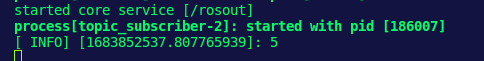
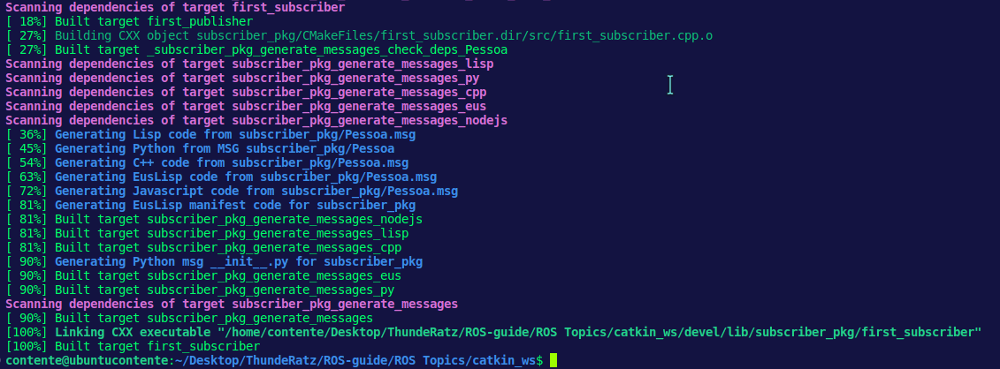
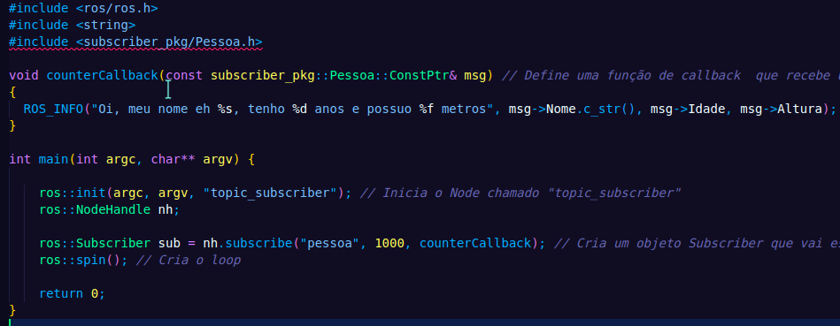
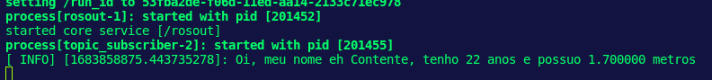

# :herb: ROS Topics - Publishers e Subscribers

Primeiramente, é essencial que você já tenha feito o primeiro módulo "ROS Basics" antes de prosseguir com esse aqui. Irei assumir que você já sabe com maestria como criar pacotes, fazer launchfiles e criar executáveis básicos no CMakeLists durante todo o processo. No repositório, você já encontra um *catkin_ws/* contendo 2 pacotes gerados por mim: *publisher_pkg* e *subscriber_pkg*.

# :memo: Tópicos

A primeira coisa que se é necessária para aprender a trabalhar com ROS
consiste em entender como funcionam os **tópicos**. ROS lida com todos
os seus sistemas de comunicação através de tópicos, desde os mais
simples até os mais complexos, como Actions e Services por exemplo. Os nodes usados em todo package vão trocar mensagens através de tópicos, sendo assim, podemos entendê-los como um canal de comunicação entre diversos nodes.

# :pencil2: Publishers

Vá para a pasta *scr/* dentro do nosso pacote *publisher_pkg* contido na *src/* da nossa catkin workspace. Lá, você irá pereber que existe um arquivo executável que tem como propósito criar um node o qual possui um publisher que irá incrementar em 1 o valor de uma dada mensagem a cada loop do código.

Possivelmente eu falei em grego para quem nunca escutou esses termos antes, mas vamos investigar com calma o que significa isso tudo. Antes de mais nada, compile o nosso package de publisher na workspace e dê launch através dos seguintes comandos:

```bash
  $ catkin_make
  $ source devel/setup.bash
  $ roslaunch publisher_pkg publisher.launch
```
E observe que não acontece nada no terminal que sugira algo sobre um contador aumentando em 1 o seu valor a cada loop. Na verdade é porque a forma de comunicação entre nodes é o grande diferencial que faz o ROS ser tão bem arquitetado. Nodes usam tópicos para publicar informações para outros nodes e assim comunicam-se entre si. Você pode listar quais são os tópicos do seu sistema após dar launch em um node abrindo um novo terminal e através do comando:
```bash
  $ rostopic list
```

Algo como isso irá aparecer:


Assim como o comando de receber informações mais aprofundadas de um node, você pode fazer o mesmo com um tópico executando:

```bash
  $ rostopic info <topic_name>
```

Sendo que no nosso caso, *<topic_name>* pode ser substituído por "/counter". Temos então:


A partir dessas informações podemos dizer que o tópico recebe mensagens do tipo std_mgs/Int32 e os Nodes que estão publicando nele é, no caso, apenas o "topic_publisher".

Isso ainda não mostrou nenhum contador aumentando de valor...
Certo, vamos usar esse outro comando:

```bash
  $ rostopic echo <topic_name>
```
Onde *<topic_name>* é o nosso "/counter". Temos o seguinte:


Agora sim temos algo que está incrementando gradualmente. Do nosso código, percebemos que esse comando extrai o valor contido na mensagem pelo atributo "data" e cospe a informação no terminal.

# Mensagens

Como dito anteriormente, tópicos lidam com informações através de mensagens. Existem diversos tipos de mensagens. No caso do nosso simples exemplo, o tipo de mensagem foi "std_msgs/Int32". Mas você pode ter vários outros e até criar o seu próprio tipo de mensagem - não é recomendado, use sempre mensagens ROS default quando possível.

As mensagens são definidas nos arquivos ".msgs" que estão localizados dentro do diretório *msg/* de um package. Você também pode extrair informações a respeito do tipo de uma mensagem através do comando:

```bash
  $ rosmsg show <message>
```

Na imagem a seguir, está alguns exemplos do que isso pode gerar:


Observamos que no caso da mensagem do nosso exemplo, ela tem apenas um atributo chamado "data" que é do tipo int32. Mas se virmos uma mensagem do tipo "geometry_msgs/Twist" veremos que ela tem vários atributos aninhados:

 - geometry_msgs/Vector3 linear
   - float64 x
   - float64 y
   - float64 z
 - geometry_msgs/Vector3 angular
   - float64 x
   - float64 y
   - float64 z

Ou seja, ela pode ser quebrada em dois tipos de mensagens "geometry_msgs/Vector3" para as características linear e angular, e essas são compostas por mensagens do tipo "float64" com 3 atributos cada: "x", "y, e "z".

# Subscribers

Similarmente ao publisher, vamos compilar o executável presente no package do subscrbiber (*subscriber_pkg/*) e dar launch no node dele. Dentro da catkin workspace faça o seguinte comando:

```bash
  $ catkin_make
  $ source devel/setup.bash
  $ roslaunch subscriber_pkg subscriber.launch
```
E então... NADA? Novamente? Calma lá, analisando o código percebemos que o nosso subscriber está esperando alguma mensagem no tópico "counter", porém se nós não publicarmos nada nesse tópico, então vai parecer que nada está acontecendo. E se publicássemos no tópico desse subscriber, o que será que aconteceria? Vamos tentar.

Ainda rodando o node do subsciber, abra um outro terminal, entre na workspace e digite o seguinte comando:

```bash
  $ rostopic pub /counter std_msgs/Int32 5
```
 Olhando novamente o terminal do nosso subscriber, vimos que existe uma nova linha no terminal:
 
 
 
 Essa última linha indica que nossa mensagem publicada pelo terminal foi recebida com sucesso e o callback do nosso subscriber printou (ROS_INFO) o valor da mensagem trocada.
 
 Analise o código do nosso subscriber (cada linha foi comentada) e pense comigo: você basicamente criou um node subscriber que escuta a um determinado tópico "/counter" e a cada vez que ele lê algo (dada a frequência do nosso ros loop), ela faz algo - no caso é printar no terminal o valor da mensagem. Inicialmente, como nada havia sido publicado no tópico, ele não estava printando nada, mas a partir do momento que damos o comando de publicar o valor de "5" no tópico, a mensagem é recebida pelo subscriber e tratada na função definida pelo callback dele.

# Misturando o Publisher com o Subscriber
Uma coisa interessante a se fazer é juntar o que foi dado até agora para ver como as peças se encaixam nesse quebra-cabeça. Se você der launch no publisher e em seguida no subsciber, podemos ver que os dois se comunicam pelo tópico em comum "/counter". Em terminais diferentes dê o launch e veja que o subscriber está printando uma contagem incremental de 1 a cada 2 Hz! Incrível, não?

# Mensagens customizadas

Caso queiramos publicar uma mensagem que não seja do tipo Int32, quais tipos eu deveríamos usar? Bom, isso depende muito da sua aplicação, mas você pode encontrar todas as mensagens ROS através do comando:
```bash
  $ rosmsg list
```

Caso nenhuma dessas te agrade, você podre *criar* um tipo de mensagem. Vamos lá.

## Criando nossa mensagem própria

Primeiramente, cria um diretório chamado "msg/" no seu package:
```bash
  $ roscd <package_name>
  $ mkdir msg
```

Após isso, crie um arquivo do tipo ".msg" dentro desse diretório. Nesse tutorial, irei criar o arquivo "Pessoa.msg" e ele irá conter os seguintes valores:
```txt
  string Nome
  int32 Idade
  float32 Altura
```

Para que funcione você deve editar algumas coisas do CMakeLists.txt do seu package:

```txt
find_package(catkin REQUIRED COMPONENTS
       roscpp
       std_msgs
       message_generation   # Adiciona o pacote message_generation
)
```

Essa parte é onde todos os pacotes necessários para compilar as mensages dos tópicos, services e actions entram. No arquivo *package.xml*, você tem de colocá-los como **build_depend**.

```txt
  add_message_files(
      FILES
      Pessoa.msg
    ) 
```

Essa função inclui todas as mensagens desse package (no pasta msg/) a serem compiladas.

```txt
  generate_messages(
      DEPENDENCIES
      std_msgs
)
```
Aqui é onde os pacotes necessários para a compilação das messagens são importados.

```txt
  catkin_package(
      CATKIN_DEPENDS roscpp std_msgs message_runtime
)
```
Nessa parte, encontram-se todos os packages que serão necessários para que alguém executa algo do seu package. Isso tudo deve estar marcado dentro do *package.xml* como **exec_depend**.

Finalmente, devemos modificar o *package.xml*. Para fazer isso, adicione essas 3 linhas no arquivo:
```xml
  <build_depend>message_generation</build_depend>
  <build_export_depend>message_runtime</build_export_depend>
  <exec_depend>message_runtime</exec_depend>
```

E então vá para sua catkin workspace e compile o pacote com catkin_make. Você verá que aperecerão novas mensagens de compilação:



**ATENÇÃO**
Antes de mais nada, faça o seguinte comando:
```bash
  $ source devel/setup.bash
```

Após isso, busque pela sua mensagem com o comando:
```bash
  rosmsg show <msg>
```

No nosso caso, *<msg>* pode ser trocada por "Pessoa". Então teremos algo como:


## Usando sua própria mensagem customizada nos nodes
Para funcionar, você adicionar no CMakeLists.txt do seu package a seguinte linhas para compilar e linkar seu executável:

```txt
add_dependencies(<executable_file> <package_name>_generate_messages_cpp)
```

Como eu estou modificando a CMakeLists.txt do subscriber deste repositório e também o arquivo do nosso subscriber fornecido, para mim, essa linha ficará da seguinte forma:

```txt
add_dependencies(first_subscriber subscriber_pkg_generate_messages_cpp)
```

E porque você precisa adicionar essa linha extra "add_depedencies()". Bom, isso é feito para assegurar que todas as mensagens contidas no pacote (<package_name>) serão compiladas *antes* que nós criemos o nosso executável. Nesse caso, o executável *first_subscriber* usa a mensagem customizada que nós acabamos de criar: Pessoa.msg. Então, o que aconteceria se tentássemos buildar o executável antes de buildar a mensagem? Iria falhar, naturalmente. Mas com esse linha, você evita essa problema.

## Dando launch no nosso node com mensagem customizada

Agora que você preparou o terreno, a imagem a seguir mostra como está meu subscriber novo preparado para receber o tipo de mensagem criado por mim anteriormente:



> Atenção, inclua o seu header customizado para que não dê erros de compilação no código

Dando catkin_make e depois source devel/setup.bash, compilamos nosso node e podemos dar launch. Com isso, o subscriber estará rodando e esperando receber uma mensagem nova. Agora você me pergunta, como que vamos publicar esse tipo de mensagem diferentonas? Abaixo está o comando:


Analisando agora a saída do nosso subscriber no nosso terminal onde ele está rodando, podemos ver que nossa jornada foi bem sucedida!



~~Daria para ajustar a quantidade de casas decimais do float~~

# Conclusão

Com o fim do módulo, você já deve entender como fazer Publisher e Subscriber básicos, o que significam tópicos em se tratando de ROS e mensagens. Também é capaz de criar seu próprio tipo de mensagem!
